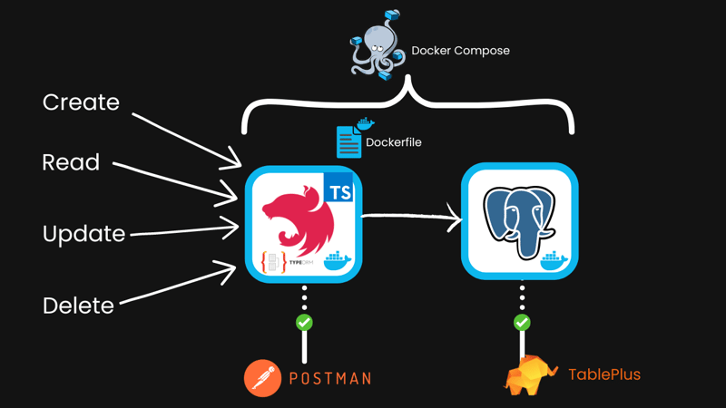

## Description

A simple restful API system allow users able to CRUD locations
Database Design have support the address location tree (PostgreSQL + TypeORM)

## Require application
 - Docker application
 - IDE (Webstorm/VS Code)

## Technical
- Docker
- Nestjs
- Typeorm/Tree-Entity
- PostgreSQL

## Running the app
- Step 1:
    - Open Docker Application
- Step 2:
    ```bash
    $ npm run start-with-docker
    ```
- When you run the command,the commands will be executed
    ```bash
      $ docker compose build && docker compose up
    ```
## Wiki  
- API Add - [API Add](https://github.com/BaoDBS/Typeorm-TreeEntity/wiki/API-Add)
- API Get All  - [API Get All](https://github.com/BaoDBS/Typeorm-TreeEntity/wiki/API-Get-All)
- API Get By Id  - [API Get By Id](https://github.com/BaoDBS/Typeorm-TreeEntity/wiki/API-Get-By-Id)
- API Update By Id  - [API Update By Id](https://github.com/BaoDBS/Typeorm-TreeEntity/wiki/API-Update-By-Id)
- API Delete By Id  - [API Delete By Id](https://github.com/BaoDBS/Typeorm-TreeEntity/wiki/API-Delete-By-Id)
## Stay in touch
- Author - [Nguyen Quoc Bao](https://github.com/BaoDBS)
